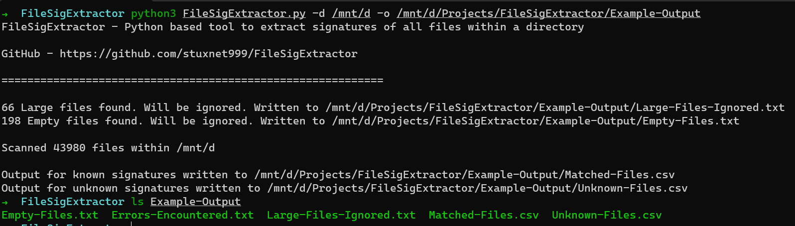

# FileSigExtractor

FileSigExtractor is a python based tool which extracts the file signatures of all files within a directory and writes the output to a CSV file.

This project is basically another implemention [Andrew Rathbun's SigHunter](https://github.com/AndrewRathbun/SigHunter) (Written in C#).

FileSigExtractor uses the python-magic library which is python wrapper for the libmagic library. The code here mimics the linux `file` command but just runs recursively over directories and produces a CSV output.

### Usage

Required parameters

+ `-d` or `--directory` - The input directory in which files to be scanned are present.
+ `-o` or `--output-dir` - The path to which the output CSV files are written.

#### Example

```
> python FileSigExtractor.py -d <target directory> -o <csv output directory>
```



The above example was run in WSL with python3.10 installed. You can run it in Windows too.

### Output Files

+ Empty-Files.txt
  + As name suggests, list of empty files within the directory.
+ Errors-Encountered.txt
  + Typically observed when running the script in Windows. Windows usually locks certain files which are not readable. Such files are skipped and listed here.
+ Large-Files-Ignored.txt
  + Files which are over 512 MB are ignored by the script.
+ Matched-Files.csv
  + CSV containing list of files whose file signature was recognized.
+ Unknown-Files.csv
  + CSV containing list of file whose signature was unrecognized.

#### Column Meaning

+ File Path
  + Absolute path of the file.
+ Original Extension
  + Observed file extension.
+ File Type
  + Signature recognized by libmagic

### Author

Abhiram Kumar

+ Twitter - [@_abhiramkumar](https://twitter.com/_abhiramkumar)
+ LinkedIn - [abhiramkumarp](https://www.linkedin.com/in/abhiramkumarp/)